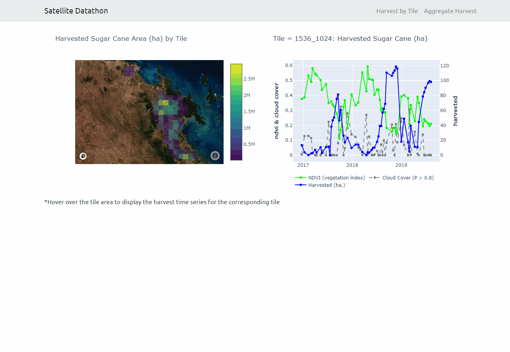

# Satellite Datathon Dash App

This dash app presents data from satellite images of sugar cane farms from North East Queensland from 2016 to 2019, and was created as part of the [Data Science Melbourne Datathon](https://medium.com/satellite-intelligence), August - November 2019. 

For the competition, our team built a choropleth & time series app to provide insights on the harvesting of sugar cane farms for mill processors, fulfilling the requirement of building an interactive Data2App website.

The [code repository](https://github.com/satellite-datathon/sdthon) and [final video presentation](https://drive.google.com/file/d/1HKftlyNhEO_gQUNMjIgwD9MlNCGQCs6K/view) are also available online.



In the first view 'Harvest by Tile', a time series of harvested sugar cane values are shown depending on the choropleth tile selected by the user. The time series graph displays the amount of sugar harvested and provides an indication of peak harvest periods. The lighter colours indicate more productive sugar cane farm areas.

In the second view 'Aggregate Harvest', an aggregate time series of harvested values is shown, with a choropleth map of sugar cane area reflecting the time period selected by the user, by clicking on the line graph.

## Further Details

Sugar cane harvest amounts were determined by processing 512 x 512 images based on the gradation of colour of sugar pixels (green as compared with red, green and blue).

### Figure 1: Example Sugar Cane Tile Image 


This required an adjustement for masked images to filter out non sugar cane farm regions, while the satellites also captured images across 10 colour frequency bands. 

### Figure 2: Harvested Regions in Example Sugar Cane Tile Image 


### Figure 3: Example of Tile Image with Cloud Cover


### Figure 4: Example of Mask from Cloud Cover Detection


We accessed the sentinel-hub api to identify masks of cloud cover. Their service applied a machine learning method on a larger hand-coded dataset across mutiple colour frequency bands. 

To help determine optimal harvest time, a vegetation index was calculated from pixel values from two of the colour frequencies. 

```bash 
# main dash app files and dir structure

- app.py
- index.py
- apps
   |-- __init__.py
   |-- app1.py
   |-- app2.py

```